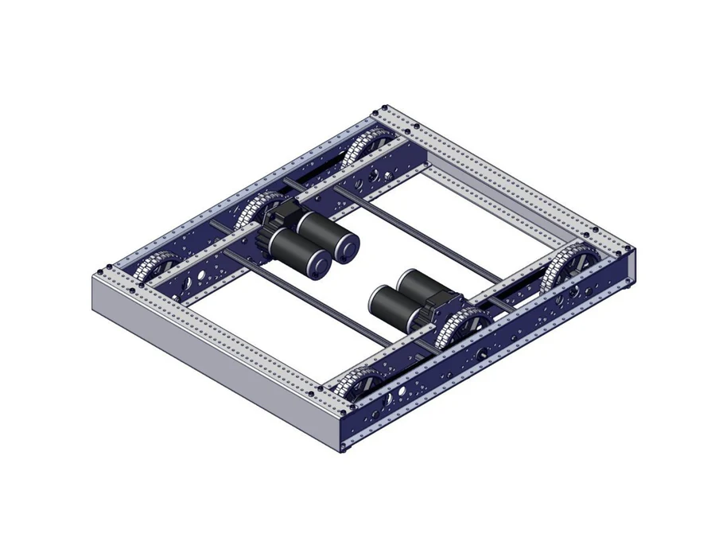
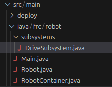
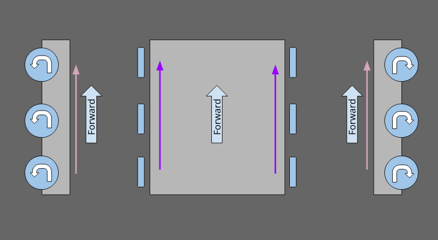
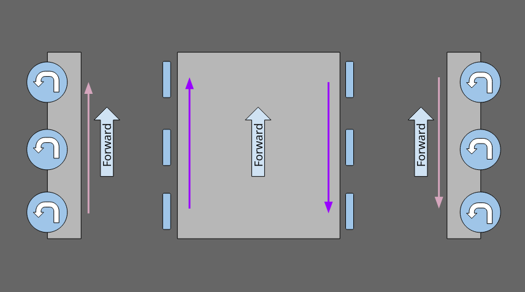
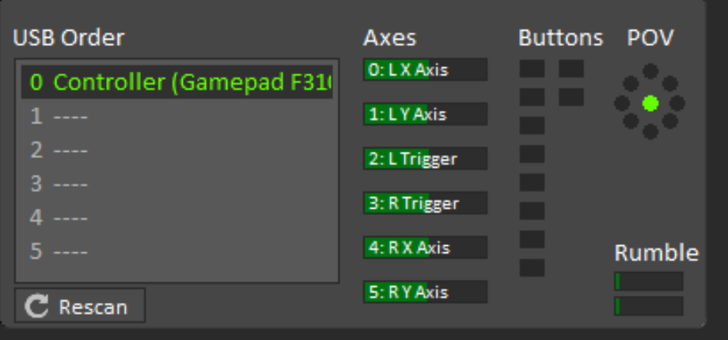

# Drive Base

It's time to implement our first subsystem: the drive base!



## Create the DriveSubsystem class

First, right click on the `src/main/java/frc/robot/` folder in the Explorer
panel and create a new folder. Name the folder `subsystems`. This folder will
be where we put the code files for each of our subsystems.

Tip: Folders within the robot code are sometimes referred to as "packages". They
are useful for keeping your code organized as the robot project grows.

Next, right click on your new folder and select "New Java File > Class...". Name
the class "DriveSubsystem". Your `src` folder should now look like this:



In order to tell Java that this class is a subsystem, not just a regular class,
we need to specify that it extends the `SubsystemBase` class:

```java
package frc.robot.subsystems;

import edu.wpi.first.wpilibj2.command.SubsystemBase;

public class DriveSubsystem extends SubsystemBase {
    // Our subsystem code will go here!
}
```

Note that because `SubsystemBase` is outside of the `subsystems` package, it needs
to be imported using an `import` statement.

We'll also need to add our subsystem to the `RobotContainer` class so that WPILib
knows it is part of our robot:

```java
// ...
import frc.robot.subsystems.DriveSubsystem;

public class RobotContainer {
    // NEW!
    private final DriveSubsystem driveBase;

    public RobotContainer() {
        // NEW!
        driveBase = new DriveSubsystem();

        configureBindings();
    }
    
    // ...
}
```


## Motors

The next step of creating a subsystem is to declare its hardware components. Our
theoretical drive base has 4 CIM drive motors, each controlled by a TalonSRX motor
controller. To declare the motors, create 4 variables within the subsystem class
like this:

```java
// ...
import com.ctre.phoenix.motorcontrol.can.TalonSRX;

public class DriveSubsystem extends SubsystemBase {
    private final TalonSRX leftMotor1;
    private final TalonSRX leftMotor2;
    private final TalonSRX rightMotor1;
    private final TalonSRX rightMotor2;
}
```

Here the motor variables are marked `private` because we only want them to be used
from within the `DriveSubsystem` class, and `final` because the robot hardware won't
change while the robot is running (hopefully!).

You may have noticed that VS Code is helpfully pointing out that the fields
"may not have been initialized", so let's fix that! In the class constructor, we
will assign values to the variables:

```java
// ...
public class DriveSubsystem extends SubsystemBase {
  // ...
  public DriveSubsystem() {
    // Initialize our motor objects.
    // The number parameters are the CAN IDs assigned to each
    // motor controller using Phoenix Tuner.
    leftMotor1 = new TalonSRX(1);
    leftMotor2 = new TalonSRX(2);
    rightMotor1 = new TalonSRX(3);
    rightMotor2 = new TalonSRX(4);
  }
}
```

Now we have all the motors ready to use. However, we currently aren't telling them to
do anything. So let's make them actually do something!


## Actually Doing Something

To control the drive base, we need to decide what the inputs to the subsystem will
be. In this tutorial we will be using arcade drive: the left stick controls
forward/back driving, and the right stick controls turning. To do this, we'll
add a `Command` to our subsystem:

```java
// ...
import java.util.function.Supplier;

public class DriveSubsystem extends SubsystemBase {
  // ...
  public Command arcadeDrive(
      Supplier<Double> forwardSupplier,
      Supplier<Double> turnSupplier) {
    return this.run(() -> {
      // Get the latest control inputs.
      double forward = forwardSupplier.get();
      double turn = turnSupplier.get();

      // TODO: Tell the motors what to do!
    });
  }
}
```

There's a lot of new syntax and concepts to unpack here! First, we're defining a
_method_ (also called a _function_), that returns a `Command`. The function takes
in two inputs: the forward speed and turn speed. You might be wondering why those
inputs have a type of `Supplier<Double>` rather than just simply `double`. This is
because when a function is called, it can only take in one set of values. If we had
used `double` parameters, we wouldn't be able to change the input values after
creating the command. Therefore instead of passing in values directly, we pass in
something that can be used to retrieve new values later: the `Supplier<Double>`.
You will see `Supplier`s used a lot in command-based code.

Within the function, we create a `run` command. This type of command simply runs
the code inside it repeatedly, forever.

Within the command, we retrieve the current `forward` and `turn` input values from
the input suppliers. Since the contents of the command are called repeatedly (50
times per second), the values will always be up to date.

However, we still haven't actually told the motors to move yet, so let's do it!

In order to drive forward, the wheels on opposite sides of the robot need to spin
in _opposite_ directions:



When turning, the wheels will need to turn the _same_ direction:



To do both at once, we can simply add together the motor outputs for each component:

```java
// ...
// Calculate how fast each set of wheels should turn.
double leftWheels = forward + turn;
double rightWheels = -forward + turn;
// ...
```

Finally, we send our calculated values to the motor controllers. Since the pairs of
motors on each side of the drive base are part of the same gearbox, we will give
the same output to each of them:

```java
// ...
// Tell the motor controllers to spin the motors!
leftMotor1.set(ControlMode.PercentOutput, leftWheels);
leftMotor2.set(ControlMode.PercentOutput, leftWheels);
rightMotor1.set(ControlMode.PercentOutput, rightWheels);
rightMotor2.set(ControlMode.PercentOutput, rightWheels);
// ...
```

As this point, we theoretically have a functioning drive base. However, we still can't
control it because we haven't configured the controller yet!


## Configuring the Controller Bindings

Back in the `RobotContainer` class, we can set up our controller inputs. First, we
need the controller itself:

```java
// ...
import edu.wpi.first.wpilibj2.command.button.CommandXboxController;

public class RobotContainer {
  private final CommandXboxController driverController;
  // ...
  public RobotContainer() {
    // The number parameter here is the port of the controller in Driver Station.
    driverController = new CommandXboxController(0);
    // ...
  }
  // ...
}
```

The number parameter to `CommandXboxController` is the port that the controller is connected
to in Driver Station. Typically port 0 is used for the driver controller, and port 1 is
used for the operator controller. However, right now we only need one controller, so
we'll use port 0.



Next, we'll link together the controller inputs and the drive base subsystem inputs:

```java
// ...
private void configureBindings() {
  // Configure the default controls for the drive base.
  driveBase.setDefaultCommand(driveBase.arcadeDrive(
      () -> -driverController.getLeftY(),
      () -> driverController.getRightX()));
}
// ...
```

We set the arcade drive command as the default command for the drive base. The default
command is the command the subsystem will run when nothing else is trying to use it,
such as an auto routine. We don't have an auto routine yet, so the default command will
run all the time. The forward input of the drive base is mapped to the Y axis of the
left thumbstick (but negated because the Y axis is upside down on the Xbox controller for
some reason :3), and the turn input is mapped to the X axis of the right thumbstick.

We are now finally ready to test the code on the real robot! To deploy the code, first
connect to the robot radio's WiFi network, then run "Deploy Robot Code" in the WPILib
Command Palette (Ctrl+Shift+P).

In FRC Driver Station, first make sure your Xbox controller is connected and set to
port 0 in the controllers tab. Then, you can enable the robot and try out your code!


## Applying Deadbands to Joystick Input

Sometimes when you let go of the thumbsticks, the robot might not come to a complete stop,
and continue moving slowly. This is because the thumbsticks don't always snap perfectly
back to the center, so they don't go back exactly to zero. Luckily, WPILib provides a
helpful method to solve this problem: `MathUtil.applyDeadband()`. It works by rounding
input values smaller than a threshold (the "deadband") down to zero, so values close to
zero will become exactly zero. It is used like this:

```java
// ...
private void configureBindings() {
  // Configure the default controls for the drive base.
  driveBase.setDefaultCommand(driveBase.arcadeDrive(
      () -> MathUtil.applyDeadband(-driverController.getLeftY(), 0.1),
      () -> MathUtil.applyDeadband(driverController.getRightX(), 0.1)));
}
// ...
```

Here the deadband value is `0.1`, so inputs with magnitude smaller than 0.1 will be clamped
to zero, and thus ignored.


## Desaturating Wheel Speeds

If you've been paying very close attention, you may have noticed a slight issue with
our current wheel calculations: If we try to drive forward and turn at max speed at
the same time, our `leftWheels` calculation will result in
`forward + turn = 1.0 + 1.0 = 2.0 = 200% output`, which our motor controllers certainly
aren't capable of! To fix this, we can check for this condition and scale down our
drive speeds back into the achievable range:

```java
// ...
// Calculate how fast each set of wheels should turn.
double leftWheels = forward + turn;
double rightWheels = -forward + turn;

// Desaturate wheel speeds if needed.
double maxOutput = Math.max(Math.abs(leftWheels), Math.abs(rightWheels));
if (maxOutput > 1.0) {
  // Too fast! Our motor controllers aren't capable of this speed, so we
  // need to slow it down.
  leftWheels = leftWheels / maxOutput;
  rightWheels = rightWheels / maxOutput;
}
// ...
```

To do this we first find the magnitude of the largest output we're trying to send. If
it's more than 100%, our inputs won't be achievable, so we need to scale them down.
We can do this by dividing both values by the maximum magnitude (the `maxOutput` variable
here). Then the large output will be scaled down to 1 (or -1), and the ratio between them
is preserved, so the robot will still go the right direction, just slower.

## Code

The code from this section can be found
[here](https://github.com/rmheuer/frc-programming-book/tree/main/code/chapter03).
