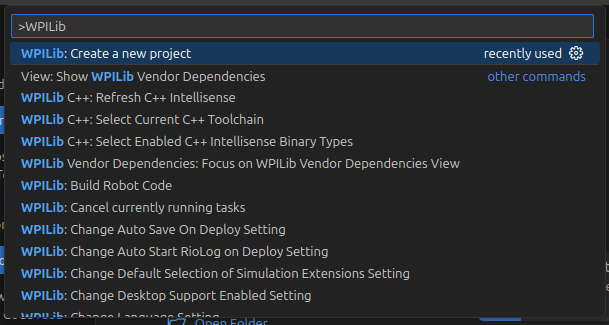
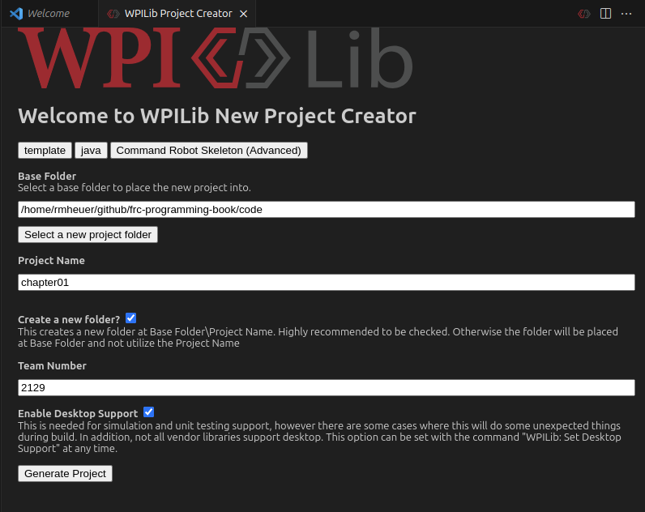
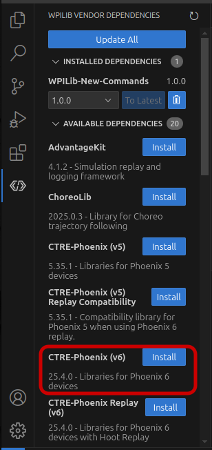

# Setting Up the Robot Project

Before we can start programming the robot, we need somewhere to put the code!
All the code for the robot will be stored within one folder, called the project.

## Project Creation

In WPILib VS Code, press Control+Shift+P to open the command palette. Then, type
"Create a new project" and press enter.

Press "Select a project type", then select "Template", "java", and
"Command Robot Skeleton (Advanced)". Despite the "Advanced" label, it is actually
less advanced than the Command Robot template :3

Press "Select a new project folder" and choose where you want to save the project.

If you are on Windows, make sure you have fully disabled OneDrive, or save the
project somewhere that is not synchronized with OneDrive, such as your user
folder (`C:\Users\USERNAME`).

Finally, press "Generate Project" and open the folder. VS Code may ask you
whether you trust the authors of the code. Press "Yes", because you are the
author!

## Vendor Dependencies

Our robot in this tutorial will use CTRE hardware, so we will need to add CTRE's
vendor library dependency. To do this, open the WPILIB Vendor Dependencies tab
in the side bar, and install "CTRE-Phoenix (v6)".

If you are using REV Robotics hardware (besides the PDH), you will need to
install the "REVLib" vendor dependency as well. However, we will not need it for
this tutorial.

## Project Structure

The generated robot project folder will contain everything you need to program a
robot. The majority of the generated files are there to support the WPILib build
system (Gradle), so you can for the most part ignore them. The folder you'll be
spending the significant majority of your time working in is the `src` folder,
which contains the Java source files, which are your actual code.

## Code

The empty project from this section can be found
[here](https://github.com/rmheuer/frc-programming-book/tree/main/code/chapter01).
