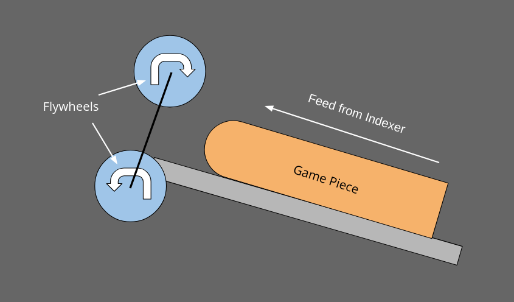

# Shooter

Now that we have a working drive base, we can start working on the mechanisms on top!
The first mechanism we will implement is the shooter.



## Create the ShooterSubsystem class

Just like for the drive base, we will create a new class in the `subsystems` package,
this time naming it `ShooterSubsystem`. Again, it will have to extend the
`SubsystemBase` class.

Also, we need to add the shooter subsystem into the `RobotContainer`:

```java
// ...
import frc.robot.subsystems.ShooterSubsystem;

public class RobotContainer {
  private final CommandXboxController driverController;

  private final DriveSubsystem driveBase;
  private final ShooterSubsystem shooter; // NEW!

  public RobotContainer() {
    driverController = new CommandXboxController(0);

    driveBase = new DriveSubsystem();
    shooter = new ShooterSubsystem(); // NEW!

    configureBindings();
  }
  // ...
}
```


## Flywheel Motor

The shooter is relatively simple hardware-wise, having only one motor attached to the
flywheels. The motor is a Kraken x60, which has a built-in Talon FX motor controller,
so let's add a `TalonFX` to the `ShooterSubsystem` class:

```java
// ...
import com.ctre.phoenix6.hardware.TalonFX;

public class ShooterSubsystem extends SubsystemBase {
  private final TalonFX flywheelMotor;

  public ShooterSubsystem() {
    flywheelMotor = new TalonFX(5);
  }
}
```

Note that the device ID of the flywheel motor must be different than the drive base
motors. Since the TalonFX is a newer device, it uses the Phoenix 6 API, so it is a
little different than the drive motors, which used Phoenix 5. Before we can use the
flywheel motor, we need to configure its _neutral mode_, which is its behavior when
the motor is not being powered. In the case of a flywheel, you generally want to
allow it to spin down slowly due to the large amount of rotational kinetic energy
they hold while spinning. Therefore we will use coast mode, which allows the motor
to spin freely:

```java
// ...
public ShooterSubsystem() {
  flywheelMotor = new TalonFX(5);

  // Set the motor to coast mode so that it can spin down slowly
  // when stopping.
  TalonFXConfiguration flywheelConfig = new TalonFXConfiguration();
  flywheelConfig.MotorOutput.NeutralMode = NeutralModeValue.Coast;

  // Send the configuration to the motor controller.
  flywheelMotor.getConfigurator().apply(flywheelConfig);
}
// ...
```


## Control Commands

For now, the shooter will have only one fixed speed, so it has two discrete states:
spinning and idle. We can create a command for each of them like this:

```java
// ...
public Command idle() {
  return this.run(() -> {
    // Stop the flywheel to conserve battery power.
    flywheelMotor.setControl(new NeutralOut());
  });
}

public Command spinFlywheel() {
  return this.run(() -> {
    // Run the flywheel at the shooting speed.
    flywheelMotor.setControl(new VoltageOut(6.0));
  });
}
// ...
```

This looks a little different than what we did for the drive base because the Phoenix
6 API is slightly different than Phoenix 5. In the idle state, we send the motor a
`NeutralOut` control request, telling it to do what we set the neutral mode to be in
the configuration, in this case coast. In the spinning state, we send the motor a
`VoltageOut` control request and specify the desired output voltage. Here voltage is
used rather than percent output (called "duty cycle" in Phoenix 6) because it allows
the flywheel velocity to remain relatively consistent regardless of changes in battery
voltage. Rather than -1 to 1, voltage output ranges from -12 to 12.

Something that can make tuning the subsystem easier is to move the voltage value out
into a constant variable. This way, if you want to change the value, it's easy to find
as it's right at the top of the class, rather than having to look through all the code
to find where you put the value:

```java
// ...
public class ShooterSubsystem extends SubsystemBase {
  private static final double SHOOT_VOLTAGE = 6.0;

  // ...

  public Command spinFlywheel() {
    return this.run(() -> {
      // Run the flywheel at the shooting speed.
      flywheelMotor.setControl(new VoltageOut(SHOOT_VOLTAGE));
    });
  }
}
```

It is common for constant variables to be named in a unique way to make it clear which
variables are constant and which will change. WPILib typically names its constants with
a `k` prefix, for example `kShootVoltage`. I personally prefer writing them in all caps
because it makes the difference very clearly visible.


## Configuring the Controller Bindings

Back in our `configureBindings()` method in `RobotContainer`, we need to configure how
the Xbox controller inputs map to the shooter controls. By default, we want the
flywheel to be in its idle state in order to conserve battery power when the robot
isn't shooting. To do this, we can set its default command to the `idle()` command we
defined:

```java
// ...
private void configureBindings() {
  // ...
  // Put the shooter flywheel in idle by default to save battery power.
  shooter.setDefaultCommand(shooter.idle());
}
// ...
```

Let's bind the flywheel to the left trigger of the operator controller. The triggers
on the Xbox controller are actually analog axis inputs, so we need to convert the
analog (`double`) value to a digital (`boolean`) value to act as a button. To do this,
we can use a class provided by WPILib, also (but unrelatedly) named `Trigger`:

```java
// ...
private void configureBindings() {
  // ...
  // Bind the flywheels to the left trigger on the operator controller.
  // Use a Trigger to convert the analog input into a digital (boolean) one.
  new Trigger(() -> (operatorController.getLeftTriggerAxis() > 0.5))
      .whileTrue(shooter.spinFlywheel());
}
// ...
```

The `Trigger` class essentially allows you to create "virtual buttons" based on a
`BooleanSupplier` (equivalent to `Supplier<Boolean>`). Here, we interpret a trigger
axis value greater than 0.5 as "pressed", and less than 0.5 as "released". We then
bind the flywheel spin command to our virtual button.


## Testing it out!

The code should now be ready to deploy to the robot! Now is the time to tune the
flywheel voltage based on the desired trajectory. Generally it is safest to start
with a small voltage value, typically around 1 volt, then gradually increase it until
you find the voltage that fires the game piece the way you want it. Once you've tuned
in your flywheel voltage, congratulations! You now have a working shooter!


## Code

The code from this section can be found
[here](https://github.com/rmheuer/frc-programming-book/tree/main/code/chapter04).
